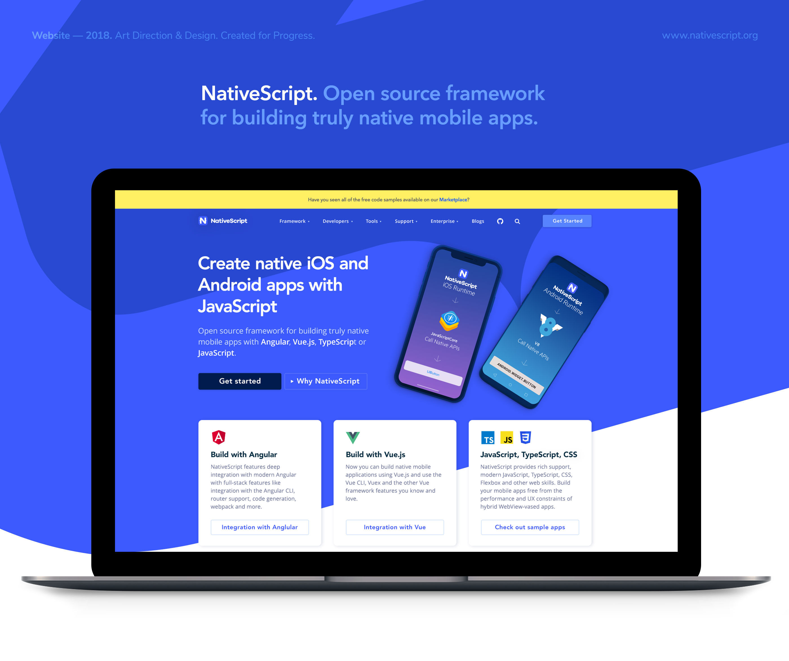
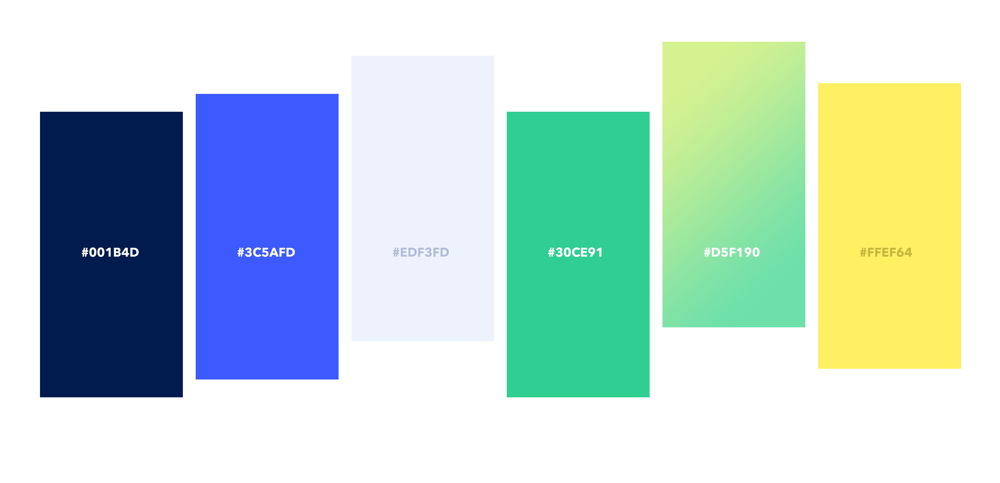
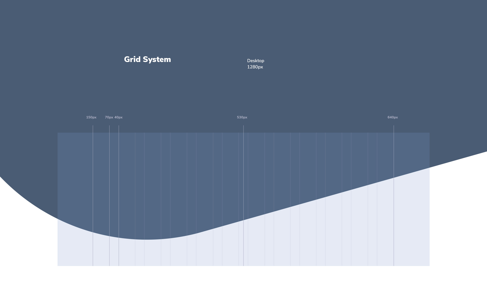
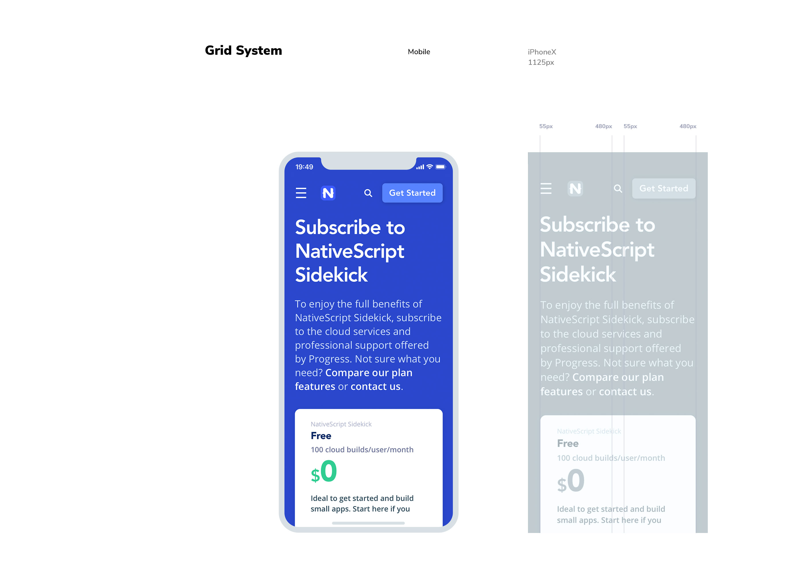
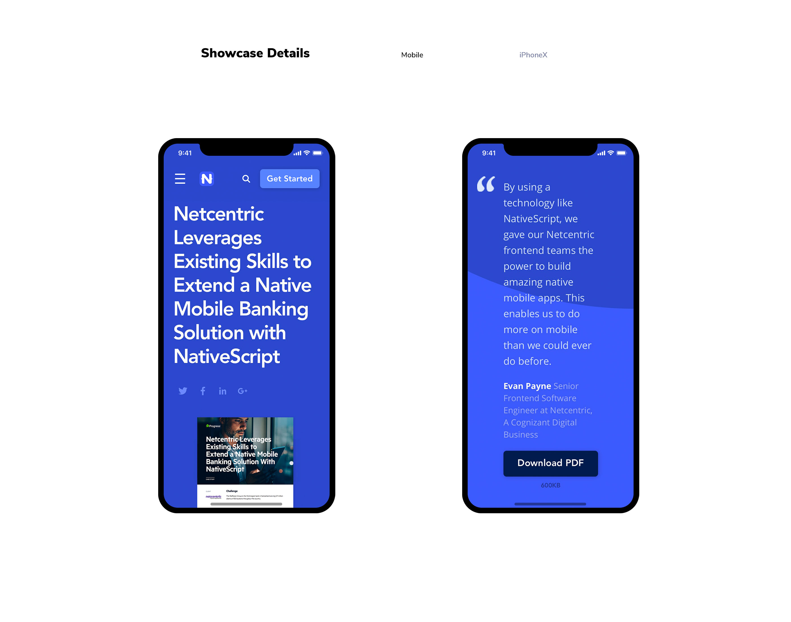
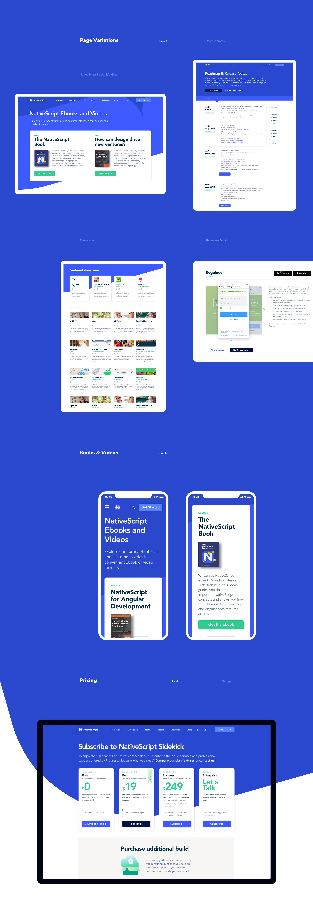
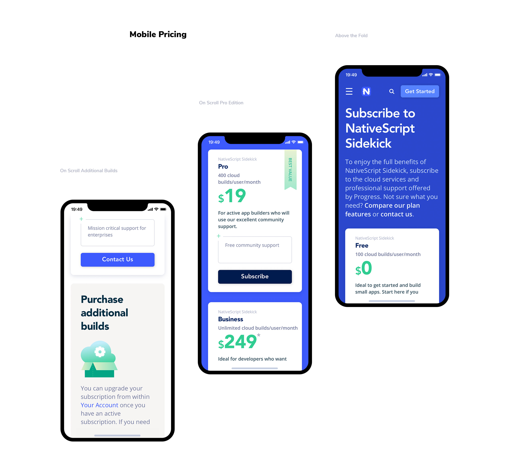
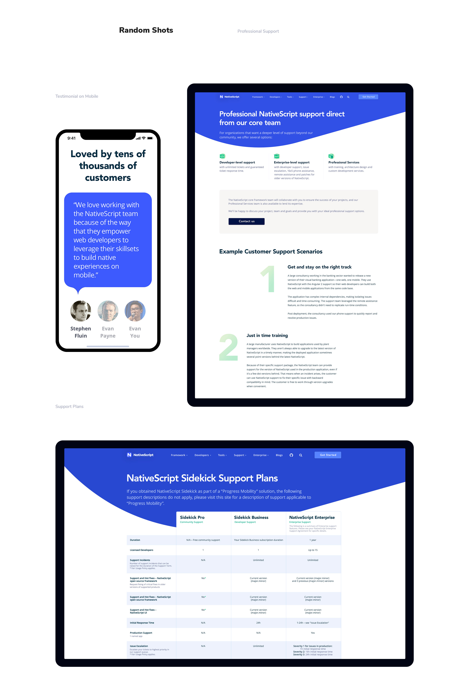

{: .one}
> ### Brieff
>
> NativeScript is an open source framework with a vibrant community of developers contributing to the project in a variety of ways. 
>
Decluttering website layout, organising information and improve readability to guide users with ease through content was an essential goal for NativeScript team.
>

{: .one}
> ### Challenge
> NativeScript is an institution among developer community. The main challenge was to create a website that truly resonates with developer audience. 
>
I had to reduce the unnecessary distractions and create consistent and predictable experience while still not oversimplifying the interface. Anticipating what users might need and ensuring that all website elements are easy to access, understand, and use was my main goal. 

{: .one}
> ### Solution
>
> I played with different crops of the logo mark to give the website individuality. The pointing arrow shape in the logo turned out to be an excellent focal point to draw users attention to particular elements in the head banner. The overall visual direction is focused on high impact colour contrast balanced with simplicity and straightforward typographic hierarchy.
>
A sidebar contextual navigation is implemented on internal pages with more content. It uses sticky positioning without overlapping the header or footer and scrolls smoothly to an anchor and makes the simple, structured sections easy to approach and digest. There are multiple clear call-to-actions on every page to help users easily achieve their goals.
>

{: .clear}
{: .clear}

{: .clear}

{: .one}
> ### Color Palette

{: .one}

> To achieve the clean look and natural feel, I chose a cool color scheme with prevailing white and NativeScript’ signature blue color as dominant focal color for backgrounds, content elements and links.

{: .clear}
.

{: .clear}

{: .one}
> ### Typography

{: .one}

> To improve readability, I chose two legible typefaces, established a clear typographic hierarchy and started experimenting to find the perfect balance between the line height, letter spacing and text size. 
I had to make sure that the content has the perfect density that is both readable and scannable.

{: .clear}

