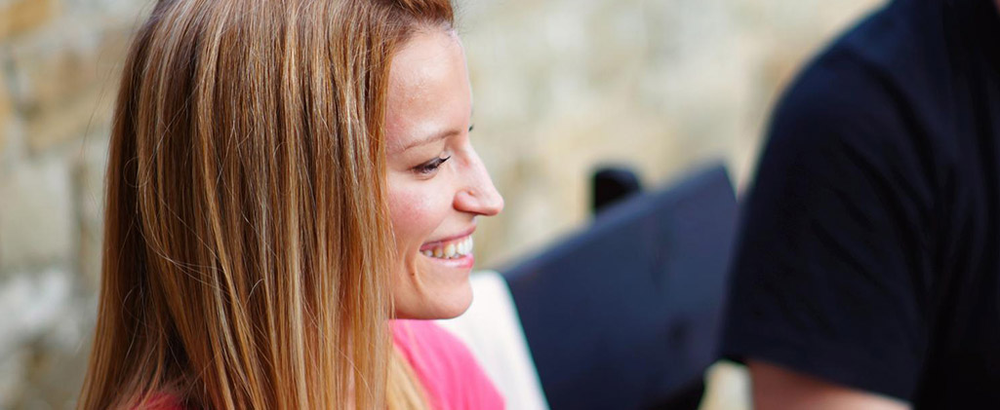

# About

*Hi, my name is Sassy, and my calling is to do design stripped down to its bare core just before it might have lost its integrity and broken down altogether. A design that does not provoke for the sake of it does not tie down to the trend of the day but instead tells visual stories without overwhelming the senses. I usually find it on the threshold between what is too much and what is too little, while looking for the balance of purpose, feeling, quantity.*

>   

{: .one}
> I am currently a VP of Design @Resolute. My mission is to create and establish Resolute’s unique, recognizable digital footprint, along with uncompromising quality.
> 
> Creating coherent customer experiences at scale is what I did before arriving at Resolute. Heading the Customer Experience team, I shaped the art direction and design of NativeScript.org, Telerik.com, Progress.com, among others, building a visually sustainable system belonging and easily recognized by the brand Progress.

{: .one}
> Before Telerik (now Progress), I've been creating web experiences at Netage for almost a decade. Intertwining all the passion and skills in what was considered the best Bulgarian web agency of its time felt right, and it was an added pleasure to get [awarded](#Awards) for these efforts at design contests.
>
> All these years and until today that passion has followed me even after I switched off for the workday. While I am not in front of a giant computer screen, I teach students from the Master of Arts Web Design Program at the National Academy of Arts – the school I also hold my master’s degree from.

{: .one}
> The little spare time that is left, I devote for causes that help and promote women entrepreneurs and designers. Since late 2017 and until today, I'm a brand advisor for Femigrants, a non-profit organization located in Silicon Valey that connects female professionals and entrepreneurs and helps them grow and prosper. I also contribute to See It Be It, a Cannes Lions initiative to promote women in design leadership as a mentor and speaker.

{: .clear}
.

***

## Journey to the bare core (Manifesto) 

*I have always tried to create design that has been stripped down to its bare core
just before it might have lost its integrity and broken down altogether.
That design does not provoke for the sake of it, it does not tie down to the trend of the day,
and does not come from the ego of the designer. Rather, it tells visual stories,
incites attention, without overwhelming the senses. In order to do so I never stop looking
for the balance of purpose, feeling, quantity. I usually find it on the threshold between
what is too much and what is too little. The journey to the edge requires process, rules,
and ingredients.*

{: .one}
> ### Complete Seclusion
>
> The designer and the canvas carry a very intimate relationship. The love child
of that relationship needs time and space to go 
through all its transformations freely, without interruptions
or premature judgement of character. The intimacy must always be preserved 
and the seclusion kept.

{: .one}
> ### Perpetual Sketching
>
> I sketch everything that comes to mind. Initially that means chaos.
But I am not afraid because I know the solution lies within.
Only when I have made it to the extremes and I have felt, 
observed and have been overwhelmed by them do the balance 
and moderation strike. My secret is that I know how to approach 
the darkness of mess. I have a concept and I follow it.

{: .one}
> ### Crossing the Line
>
> To reach a design, which is just right I experiment. I experiment 
with what is on the canvas and where my comfort zone as a designer is.
I let go of the brakes, understanding that I might get to a place
I initially presume unacceptable.
But this is not about me is it? It is about the bare core of design and that
it may only exist solely in unforeseen and uncomfortable combinations.
Naturally I am afraid of failure, mistakes and rejection on the way.
But I rest assured there is a discovery hiding somewhere, an idea waiting to be found,
or at least a lesson to be learned.

{: .clear}
.

{: .one}
> ### Design Basics
>
> Fundamental principals of design were created from an understanding 
what makes sense to the eye and the mind that processes what it sees. 
They are not a product of a simple whimsy what might look good. 
The principals have been through the test of time and are still here. 
I adhere to them because I know they will time proof everything I draw.
I never betray them because I trust them to help me create sustainability 
beyond current trends and modernity. Modernity can be tempting.
It carries a certain flair of being here and now. But the design
created today must live tomorrow as well. Therefore modernity is
more a direction than a destination. So I always return to basics.

{: .one}    
> ### Killing Darlings
>
> In the end, there is only one truly just right solution that represents the bare core.
Many designs before can fool in their appearance, pretending to be the one.
Being faithful to the brand and the audience, the designer must be ready to say no even 
when everything feels right. The designer must do what is most difficult - kill a darling. 
That seemingly great darling design must be hurdled no matter how difficult it is.
Because too often the genius hides right behind. Thus I leap until I have made it 
to the core. The bare core of design. 

{: .clear}
.

***

## Awards 

{: .list .one .indent-one}
+   **Website of the Year** 2015
    - Techies (TechWorld) Awards, February 2016
    - [telerik.com](/works/telerik.html)

+   **Best Website Homepage Design** Hubspot List
    - Hubspot, May 2016
    - [telerik.com](/works/telerik.html)

+   **Website of the Year** Technology and Design
    - BG Web Awards, June 2015
    - [telerik.com](/works/telerik.html)

+   **1st Prize** for UX and Usability
    - BG Web Awards, June 2015
    - [telerik.com](/works/telerik.html)

+   **1st Prize** for Corporate Website
    - Fobes E-volution, April 2015
    - [telerik.com](/works/telerik.html)

+   **Best Website Homepage Design** Hubspot List
    - Hubspot, January 2015
    - [telerik.com](/works/telerik.html)

+   **1st Prize** in Category Services
    - Bulgarian Web Awards, June 2011
    - [metropolitanhotelsofia.com] (/works/metropolitan.html)

+   **1st Prize** Audience Award in Education, Science and Culture
	- BG Site, November 2011
    - btv.bg/seriali/7chasa/
						
+   **1st Prize** in Category Culture and Art
	- Bulgarian Web Awards, June 2011
	- btv.bg

+   **1st Prize** in Category Cause, Event, Community
	- BG Site, November 2010
    - webcafe.bg
						
+   **1st Prize** in Category Media
	- BG Site, November 2010
	- btv.bg

+   **1st Prize** in Category Content
	- Bulgarian Web Awards, June 2010
	- webcafe.bg

+   **1st Prize** Audience Award in Category Promo Site
	- BG Site, November 2010
	- btv.bg/seriali/glass-home/

+   **1st Prize** in Category Culture and Art
	- Bulgarian Web Awards, June 2010
	- btv.bg/seriali/glass-home/

+   **1st Prize** in Category Finance
	- BG Site, November 2009
	- fibank.bg

+   **2nd Prize** Audience Award in Category Education, Science and Culture
	- BG Site, November 2011
	- btv.bg/seriali/stolichani/

+   **2nd Prize** in Category Media
	- BG Site, November 2011
    - btv.bg

+   **2nd Prize** Audience Award in Category Media
	- BG Site, November 2011
    - btv.bg
						
+   **2nd Prize** in Category Finance
	- BG Site, November 2010
	- unionbank.bg

+   **2nd Prize** in Category Promo Site
	- BG Site, November 2010
	- btv.bg/seriali/glass-home/

+	**3rd Prize** Audience Award in Category Finance 
	- BG Site, November 2010
    - unionbank.bg

+	**3rd Prize** in Category Cause, Event, Community
	- BG Site, November 2010
	- btv.bg/shows/velikolepnata-shestorka/

+	**1st Prize** in Category Corporate Website 
	- BG Site, November 2009
    - mtel.bg

+   **3rd Prize** Audience Award in Category Cause, Event, Community
	- BG Site, November 2010
	- btv.bg/shows/velikolepnata-shestorka/
						
+	**Autor of the Year** for Netage 
	- Bulgarian Web Awards, June 2009
	- netage.bg

+	**2nd Prize** Audience Award in Category Media
	- BG Site, November 2010
	- btv.bg

+	**3rd Prize** Audience Award in Category Media
	- BG Site, November 2010
	- btv.bg/shows/gospodari-na-efira/

+   **2nd Prize** in Category Finance
	- Bulgarian Web Awards, June 2010
	- unionbank.bg
					
+	**2nd Prize** in Category News
	- Bulgarian Web Awards, June 2010
	- btv.bg/news/

+	**2nd Prize** in Category Society and Politics
	- Bulgarian Web Awards, June 2010
	- webcafe.bg
			
+   **2nd Prize** in Category Home Page
	- Bulgarian Web Awards, June 2010
    - btv.bg

+   **2nd Prize** in Category Social Media 
	- BG Site, November 2009
	- zamamaimen.bg

+	**3rd Prize** Audience Award in Category Finance
	- BG Site, November 2009
    - fibank.bg

+	**1st Prize** in Category Sport 
	- Bulgarian Web Awards, June 2009
    - topsport.bg
    
+	**1st Prize** in Category Services 
	- Bulgarian Web Awards, June 2009
    - [netage.bg](/works/netage.html)

+	**1st Prize** in Category Social Network 
	- Bulgarian Web Awards, June 2009
    - zamamaimen.com
			
+	**1st Prize** in Category Business 
	- Bulgarian Web Awards, June 2009
    - fibank.bg

+	**1st Prize** in Category Style 
	- International Web Festival Albena, June 2008
    - [viewsofia.com](/works/viewsofia.html)

+	**2nd Prize** in Category Properties 
	- International Web Festival Albena, June 2008
	- [tahov.com] (/works/tahov.html)

+	**3rd Prize** in Category Information 
	- International Web Festival Albena, June 2008
	- topsport.bg

+	**1st Prize** in Category Personal Site 
	- BG Site, November 2006
	- sassyworks.com
			
+	**1st Prize** in Category Finance 
	- BG Site, November 2006
    - money.bg

+	**1st Prize** in Category Sport 
	- BG Site, November 2006
    - topsport.bg

+	**1st Prize** in Category News 
	- BG Site, November 2006
    - news.bg

+	**2nd Prize** in Category Sites Optimized for Mobile Devices 
	- BG Site, November 2006
    - roam-n-roll.com

+	**2nd Prize** in Category Industry and Manufacture 
	- BG Site, November 2006
    - nikrommebel.bg

+	**3rd Prize** in Category Industry and Manufacture 
	- BG Site, November 2006
    - mim.bg

+	**Nominee Audience Award** in Category Finance 
	- BG Site, November 2006
    - money.bg

+	**Special Award for Best Use of Animation/Video** 
	- International Web Festival Albena, June 2006
    - capasca.com

+	**Nominee Audience Award** in Category Sites Optimized for Mobile Devices 
	- BG Site, November 2006
    - roam-n-roll.com

+	**1st Prize** in Category Fashion 
	- International Web Festival Albena, June 2006
    - capasca.com

+	**1st Prize** in Category Sports 
	- International Web Festival Albena, June 2006
    - maleevaclub.com

+   **1st Prize** in Category Mobile Devices 
	- International Web Festival Albena, June 2006
    - roam-n-roll.com

+	**1st Prize** in Category Services 
	- BG Site, November 2005
    - 01001.bg
						
+	**1st Prize** in Category Sport 
	- BG Site, November 2005
    - maleevaclub.com

+	**1st Prize** in Category Online Advertising Campaign 
	- BG Site, November 2005
    - maleevaclub.com

+	**Nominee Audience Award** in Category Sport 
	- BG Site, November 2006
	- topsport.bg

+	**1st Prize** in Category Organizations 
	- International Web Festival Albena, June 2005
    - csees.net
			
+	**IT Innovation Award** in Category E-education 
	- eWeekBG, PC Magazine BG, Spisanie.com, November 2004
	- mu-sofia.bg

+	**2nd Prize** in Category Industry and Manufacture 
	- BG Site, November 2005
    - capasca.com

+	**2nd Prize** in Category Arts 
	- International Web Festival Albena, June 2004
	- illustrationcupboard.com

+	**3rd Prize** in Category Services 
	- BG Site, November 2005
	- orbitel.bg

+	**3rd Prize Audience Award** in Category Sport 
	- BG Site, November 2005
    - maleevaclub.com

+	**3rd Prize Audience Award** in Category Online Advertising Campaign 
	- BG Site, November 2005
    - maleevaclub.com

+   **3rd Prize** in Category E-commerce
	- BG Site, November 2005
    - darexpress.net

+	**Nominee Audience Award** in Category News 
	- BG Site, November 2006
	- news.bg

+	**Nominee** in Category Information and Services for Real Estate and Furnishing 
	- International Web Festival Albena, June 2006
    - nikrommebel.bg

+	**Nominee** in Category Automotive 
	- International Web Festival Albena, June 2006
    - toyotires.bg

+   **Nominee** in Category Health 
	- BG Site, November 2005
    - biotrade-bg.com
